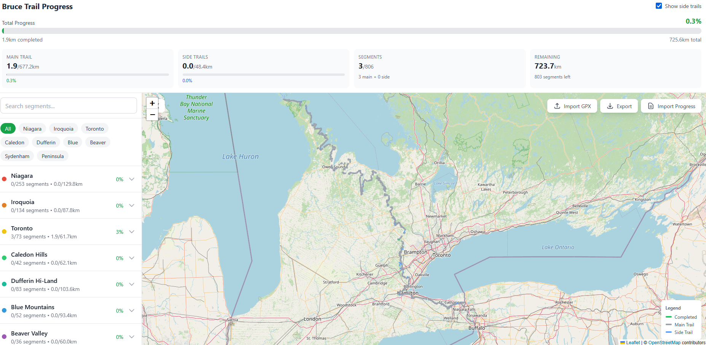
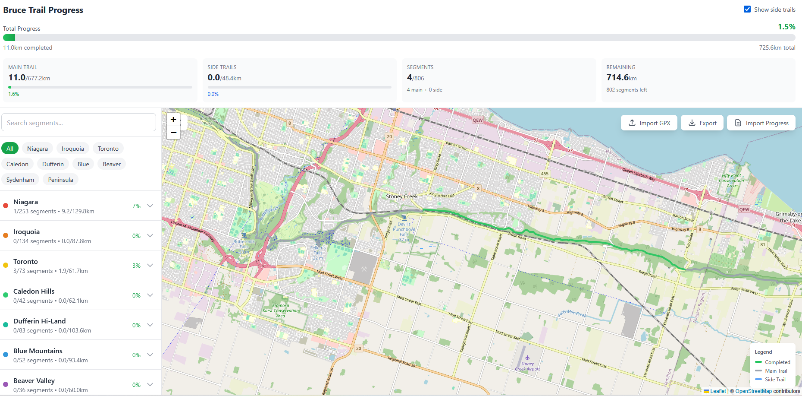
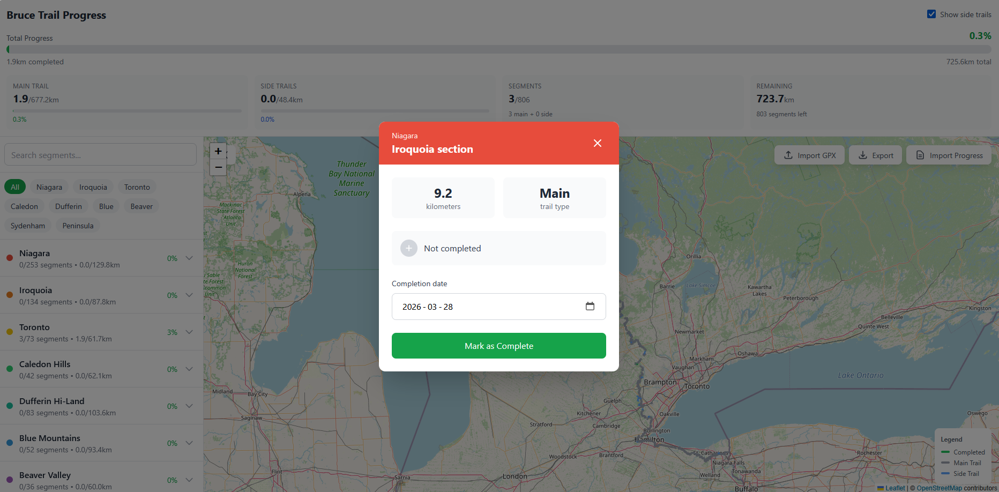

# Bruce Trail Progress Tracker

A React web application to track your hiking progress along the Bruce Trail in Ontario, Canada.



## About the Bruce Trail

The Bruce Trail is Canada's oldest and longest marked hiking trail, stretching over 900 km along the Niagara Escarpment from Niagara Falls to Tobermory. The trail is maintained by the Bruce Trail Conservancy and divided into 9 club sections, each managed by local volunteers. With hundreds of individual segments and side trails totaling over 1,400 km of hiking, this app helps you track your progress toward completing the entire trail.

## Features

- **Interactive Map** - Leaflet-based map showing all trail segments with color-coded completion status
- **Progress Tracking** - Mark segments as complete with dates, track progress by club section
- **9 Club Sections** - Niagara, Iroquoia, Toronto, Caledon, Dufferin, Blue Mountains, Beaver Valley, Sydenham, Peninsula
- **GPX Import** - Import trail data from GPX files with drag-and-drop support
- **Export/Import Progress** - Save your progress as JSON and restore it anytime
- **Statistics** - View completion percentages for main trail, side trails, and overall progress
- **Local Storage** - Progress is automatically saved in your browser





## Getting Started

### Prerequisites

- Node.js 18+
- npm

### Installation

```bash
# Clone the repository
git clone https://github.com/CavaletGTA/Bruce-trail-app.git
cd Bruce-trail-app

# Install dependencies
npm install

# Start development server
npm run dev
```

The app will be available at `http://localhost:5173`

### Build for Production

```bash
npm run build
```

## Usage

1. **View the Map** - Pan and zoom to explore trail segments
2. **Click a Segment** - Opens a modal to mark it complete with a date
3. **Filter by Club** - Use the sidebar buttons to focus on specific sections
4. **Toggle Side Trails** - Show/hide side trails using the header toggle
5. **Import GPX** - Click "Import GPX" to load custom trail data
6. **Export Progress** - Click "Export" to download your progress as JSON
7. **Import Progress** - Click "Import Progress" to restore from a previous export

## Tech Stack

- **React 18** - UI framework
- **Vite** - Build tool and dev server
- **Leaflet** - Interactive maps
- **Tailwind CSS** - Styling
- **LocalStorage** - Data persistence

## Project Structure

```
src/
├── components/
│   ├── TrailMap.jsx      # Leaflet map with polylines
│   ├── SectionList.jsx   # Sidebar with club/segment list
│   ├── ProgressStats.jsx # Header with progress bars
│   ├── SectionModal.jsx  # Modal for segment completion
│   └── ImportGPX.jsx     # GPX file import dialog
├── hooks/
│   └── useProgress.js    # Progress tracking hook
├── utils/
│   └── trail.js          # Distance calculation, date formatting
├── data/
│   └── bruceTrail.js     # Trail segment data
├── App.jsx               # Main app container
└── main.jsx              # React entry point
```